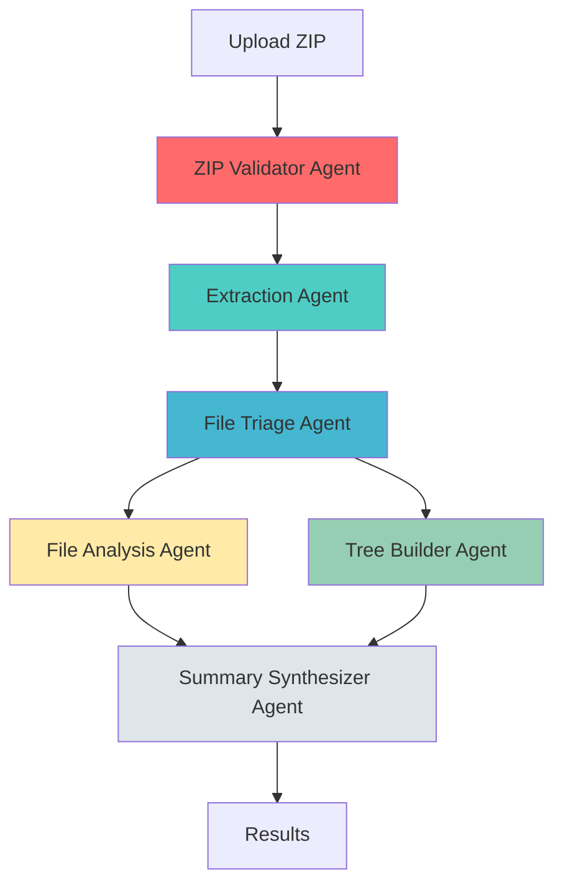

<div align="center">

# ⚡ AI Project Analyzer

### **Transform Any Codebase Into Actionable Insights**
*Enterprise-Grade AI-Powered Code Analysis in Seconds*

[](https://opensource.org/licenses/Apache-2.0)
[](https://www.python.org/)
[](https://github.com/astral-sh/ruff)
[](http://mypy-lang.org/)
[](https://github.com/ruslanmv/ai-project-analyzer/pulls)

[Features](#-features) • [Quick Start](#-quick-start) • [Documentation](#-documentation) • [Examples](#-examples) • [Contributing](#-contributing)

</div>

---

## 🎯 **The Why**

Ever inherited a codebase you don't understand? Need to quickly audit a GitHub repo? Want instant documentation for legacy projects?

**AI Project Analyzer** is your solution. A production-ready, multi-agent AI system that:
- 📊 **Analyzes** any ZIP'd codebase in seconds
- 🌳 **Generates** beautiful directory trees with intelligent categorization
- 📝 **Summarizes** every file with contextual insights
- 🎨 **Produces** publish-ready project overviews
- 🚀 **Scales** from tiny scripts to enterprise monoliths

Built with enterprise-grade architecture, strict type safety, and zero compromises on code quality.

---

## ✨ **Key Features**

### **🤖 Multi-Agent Intelligence**
Powered by BeeAI framework with specialized agents:
- **ZIP Validator** - Security-first archive validation
- **Smart Extraction** - Intelligent file discovery and extraction
- **File Triage** - Priority-based analysis scheduling
- **Tree Builder** - Visual structure generation
- **Deep Analysis** - Language-aware code comprehension
- **Synthesizer** - AI-powered summary generation

### **🎨 Beautiful UX**
- **CLI** - Rich terminal UI with progress bars, spinners, and formatted tables
- **Web** - Modern FastAPI interface with real-time SSE updates
- **Both** - Seamless switching between CLI and web workflows

### **🔌 Flexible LLM Support**
- ✅ **OpenAI** (GPT-4, GPT-4o-mini)
- ✅ **Ollama** (Llama3, Mistral, CodeLlama - fully offline)
- ✅ **IBM WatsonX** (Granite models)
- 🔜 Anthropic Claude, Google Gemini

### **⚙️ Production-Ready**
- **100% Type Hints** - Strict mypy compliance
- **Pydantic V2** - Rock-solid data validation
- **Structured Logging** - JSON output for log aggregation
- **Docker Ready** - Multi-stage optimized builds
- **Async First** - High-performance I/O
- **Comprehensive Tests** - pytest with >80% coverage

---

## 🚀 **Quick Start**

### **Prerequisites**
- Python 3.10+
- [UV](https://github.com/astral-sh/uv) (recommended) or pip

### **Installation**

#### **Option 1: UV (Fastest)**
```bash
# Install UV if you haven't
curl -LsSf https://astral.sh/uv/install.sh | sh

# Clone and setup
git clone https://github.com/ruslanmv/ai-project-analyzer.git
cd ai-project-analyzer

# Install dependencies
make dev

# Configure environment
cp .env.sample .env
# Edit .env and add your OPENAI_API_KEY or configure Ollama
```

#### **Option 2: Docker**
```bash
docker pull ruslanmv/ai-project-analyzer:latest
docker run -p 8000:8000 \
  -e OPENAI_API_KEY="sk-..." \
  -e BEEAI_MODEL="openai/gpt-4o-mini" \
  ruslanmv/ai-project-analyzer:latest
```

#### **Option 3: Docker Compose (with Ollama)**
```bash
docker compose up --build
# Access at http://localhost:8000
```

---

## 💻 **Usage**

### **CLI Mode**

```bash
# Analyze a codebase
ai-analyzer analyze /path/to/project.zip

# Use specific model
ai-analyzer analyze project.zip --model openai/gpt-4o

# Save results to JSON
ai-analyzer analyze project.zip --output results.json

# Verbose mode
ai-analyzer analyze project.zip --verbose

# View configuration
ai-analyzer config

# Show version
ai-analyzer version
```

### **Web Mode**

```bash
# Start web server
ai-analyzer server

# Or with custom settings
ai-analyzer server --host 0.0.0.0 --port 8080 --reload
```

Then visit `http://localhost:8000` and drag-and-drop your ZIP file.

### **Python API**

```python
from ai_project_analyzer import analyze_codebase
from pathlib import Path

# Analyze a codebase
results = analyze_codebase(
    zip_path=Path("my-project.zip"),
    model="openai/gpt-4o-mini"
)

# Access results
print(results.tree_text)           # Directory tree
print(results.file_summaries)      # List of file analyses
print(results.project_summary)     # Overall summary
```

---

## 📊 **Example Output**

### **Directory Tree**
```
my-app/
├── 📄 src/
│   ├── 🐍 main.py                  (Python: FastAPI app entry)
│   ├── 🐍 models.py                (Python: Pydantic models)
│   └── 📁 services/
│       ├── 🐍 auth.py              (Python: JWT authentication)
│       └── 🐍 database.py          (Python: SQLAlchemy ORM)
├── 📄 tests/
│   ├── 🧪 test_main.py             (Python: FastAPI tests)
│   └── 🧪 test_auth.py             (Python: Auth unit tests)
├── 📄 requirements.txt             (Dependencies: FastAPI, SQLAlchemy...)
└── 📄 README.md                    (Documentation: API reference)
```

### **File Summaries**
| Path | Type | Summary |
|------|------|---------|
| `src/main.py` | Python | FastAPI application with 5 endpoints, JWT middleware |
| `src/models.py` | Python | Pydantic models: User, Post, Comment |
| `tests/test_main.py` | Python | 12 pytest test cases for API endpoints |

### **Project Summary**
> **FastAPI REST API with Authentication**
>
> A production-ready REST API built with FastAPI, featuring JWT-based authentication, SQLAlchemy ORM for PostgreSQL, and comprehensive pytest coverage. The project follows clean architecture principles with clear separation between routes, services, and data models. Includes Docker configuration and CI/CD pipelines.

---

## 🏗️ **Architecture**



**Clean Architecture Layers:**
- **Domain** - Business models and entities
- **Services** - Workflow orchestration
- **Infrastructure** - File I/O, encoding, external APIs
- **Presentation** - CLI and Web interfaces

---

## 📖 **Documentation**

- [Architecture Guide](docs/ARCHITECTURE.md)
- [API Reference](docs/API.md)
- [Contributing Guidelines](docs/CONTRIBUTING.md)
- [Changelog](CHANGELOG.md)

---

## 🛠️ **Development**

### **Setup Development Environment**
```bash
# Install dependencies
make dev

# Run tests
make test

# Run linters
make lint

# Format code
make format

# Full audit (lint + type-check + security + tests)
make audit

# Run local server
make start
```

### **Available Make Commands**
```bash
make help          # Show all available commands
make install       # Install production dependencies
make dev          # Install dev dependencies
make clean        # Remove build artifacts
make test         # Run test suite
make lint         # Run ruff linter
make format       # Format code
make audit        # Full quality check
make start        # Start web server
make docker-build # Build Docker image
```

---

## 🧪 **Testing**

```bash
# Run all tests
make test

# Fast tests (no coverage)
make test-fast

# Run specific test
uv run pytest tests/test_workflow.py -v

# Run with coverage report
uv run pytest --cov --cov-report=html
```

---

## 🌟 **Why Choose This Over Alternatives?**

| Feature | AI Project Analyzer | Traditional Tools |
|---------|---------------------|-------------------|
| **AI-Powered** | ✅ Multi-agent LLM analysis | ❌ Static rules only |
| **Visual Output** | ✅ Beautiful CLI + Web UI | ❌ Plain text |
| **Offline Mode** | ✅ Ollama support | ❌ Cloud only |
| **Type Safety** | ✅ 100% typed | ⚠️ Partial |
| **Production Ready** | ✅ Docker, logging, tests | ⚠️ Demo quality |
| **Multi-Language** | ✅ Supports 20+ languages | ⚠️ Limited |

---

## 🤝 **Contributing**

We love contributions! See [CONTRIBUTING.md](docs/CONTRIBUTING.md) for guidelines.

**Quick Start:**
1. Fork the repo
2. Create a feature branch (`git checkout -b feature/amazing-feature`)
3. Commit your changes (`git commit -m 'Add amazing feature'`)
4. Push to the branch (`git push origin feature/amazing-feature`)
5. Open a Pull Request

---

## 📝 **License**

**Apache License 2.0** - see [LICENSE](LICENSE) file for details.

This means you can:
- ✅ Use commercially
- ✅ Modify
- ✅ Distribute
- ✅ Sublicense
- ❌ Hold liable

---

## 👤 **Author**

**Ruslan Magana**
- Website: [ruslanmv.com](https://ruslanmv.com)
- GitHub: [@ruslanmv](https://github.com/ruslanmv)
- Twitter: [@ruslanmv](https://twitter.com/ruslanmv)

---

## 🙏 **Acknowledgments**

- [BeeAI Framework](https://github.com/i-am-bee/beeai-framework) for multi-agent orchestration
- [Typer](https://typer.tiangolo.com/) & [Rich](https://rich.readthedocs.io/) for beautiful CLI
- [FastAPI](https://fastapi.tiangolo.com/) for modern web framework
- [UV](https://github.com/astral-sh/uv) for blazing-fast dependency management
tps://api.star-history.com/svg?repos=ruslanmv/ai-project-analyzer&type=Date)](https://star-history.com/#ruslanmv/ai-project-analyzer&Date)

---

<div align="center">

**Made with ❤️ by [Ruslan Magana](https://ruslanmv.com)**

[⬆ back to top](#-ai-project-analyzer)

</div>
