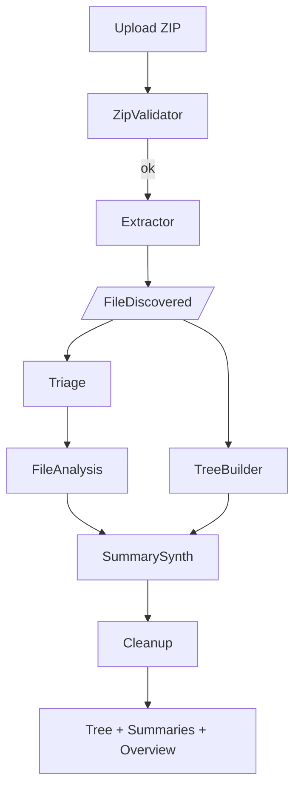

# 🐝 AI Project-Analizer – Auto-explain any ZIPped codebase

<p align="center">
  
</p>

AI Project-Analizer is a **multi-agent BeeAI application** that turns a ZIP
archive of source code into:

1. A nicely formatted directory tree  
2. Per-file one-line blurbs (kind + summary)  
3. A concise, human readable project overview

It runs **offline** with a local Ollama model *or* uses your favourite
cloud LLM (OpenAI, Watson x…). A minimal FastAPI front-end lets you drag
& drop a ZIP and watch progress live via Server-Sent Events.

---

## Quick-start

### 1. Local (no Docker)

```bash
git clone https://github.com/ruslanmv/ai-project-analizer.git
cd ai-project-analizer
cp .env.sample .env               # fill in OPENAI_API_KEY or set BEEAI_MODEL
bash install.sh                   # creates .venv & installs deps

# CLI mode
python -m src /path/to/archive.zip

# Web UI
uvicorn app:app --reload
open http://localhost:8000
````

### 2. Docker

```bash
docker build -t ai-analyser .
docker run -p 8000:8000 \
           -e OPENAI_API_KEY=$OPENAI_API_KEY \
           ai-analyser
```

### 3. Docker-Compose (with Ollama side-car)

```bash
docker compose up --build
# open http://localhost:8000
```

---

## High-level workflow



Agents communicate via **BeeAI events**; see
[`docs/architecture.md`](docs/architecture.md) for the detailed event spec.

---

## API (REST)

| Endpoint       | Method               | Description                     |
| -------------- | -------------------- | ------------------------------- |
| `/`            | **GET**              | Upload wizard (HTML)            |
| `/analyse`     | **POST** (multipart) | Upload a ZIP – returns `job_id` |
| `/events/{id}` | **GET** (SSE)        | Stream live agent events        |
| `/result/{id}` | **GET**              | Final JSON artefacts            |
| `/health`      | **GET**              | Liveness probe                  |

Full request/response examples are in [`docs/api.md`](docs/api.md).

---

## Developer notes

* Agents live under **`src/agents/`**, each in charge of one pipeline stage.
* The same DAG is declared twice:

  * **Imperative** in `src/workflows.py`
  * **Declarative** in `beeai.yaml` for `beeai run …`
* Unit-tests sit in `tests/` (pytest).
* Large docs: see [`docs/`](docs/) for sequence diagrams & REST schema.

---

## License

MIT © 2025 ruslanmv.com

````

---

## `docs/architecture.md`

```markdown
# Architecture & Event-flow

## 1 Sequence diagram (Mermaid)

```mermaid
sequenceDiagram
    autonumber
    participant User
    participant WebAPI as FastAPI
    participant BeeAI
    participant V as ZipValidator
    participant E as Extractor
    participant T as TreeBuilder
    participant R as FileTriage
    participant A as FileAnalysis
    participant S as SummarySynth
    User ->> WebAPI: POST /analyse (ZIP)
    WebAPI ->> BeeAI: emit NewUpload
    BeeAI ->> V: NewUpload
    V -->> BeeAI: ZipValid / ZipInvalid
    BeeAI ->> E: ZipValid
    loop For each file
        E -->> BeeAI: FileDiscovered
    end
    E -->> BeeAI: ExtractionDone
    BeeAI ->> T: FileDiscovered*
    BeeAI ->> R: FileDiscovered*
    R ->> A: FileForAnalysis*
    A -->> BeeAI: FileAnalysed*
    BeeAI ->> S: TreeBuilt + FileAnalysed*
    S -->> BeeAI: SummaryPolished
    BeeAI -->> WebAPI: event WORKFLOW_DONE
    WebAPI -->> User: SSE + /result/{id}
````

## 2 Event types

| Type               | Producer     | Payload fields                |
| ------------------ | ------------ | ----------------------------- |
| `NewUpload`        | FastAPI      | `zip_path`                    |
| `ZipValid`         | ZipValidator | `zip_path`                    |
| `ZipInvalid`       | ZipValidator | `reason`                      |
| `FileDiscovered`   | Extractor    | `path`                        |
| `ExtractionDone`   | Extractor    | `base_dir`                    |
| `TreeBuilt`        | TreeBuilder  | `tree_path`                   |
| `FileForAnalysis`  | FileTriage   | `path`, `score`               |
| `FileAnalysed`     | FileAnalysis | `rel_path`, `kind`, `summary` |
| `AnalysisComplete` | FileAnalysis | —                             |
| `ProjectDraft`     | SummarySynth | `draft`                       |
| `SummaryPolished`  | SummarySynth | `summary_path`                |
| `CleanupDone`      | Cleanup      | —                             |

## 3 Directory layout recap

```
src/
  agents/
    zip_validator_agent.py
    extraction_agent.py
    …
  tools/
  utils/
static/
templates/
docs/
```

## 4 Extending

1. **Add an agent** in `src/agents/`.
2. Update dependency chain in `beeai.yaml` and `src/workflows.py`.
3. Write a unit-test in `tests/`.
4. Re-build Docker image.

That’s it!

````

---

## `docs/api.md`

```markdown
# REST API Contract

> Base URL when running locally via `uvicorn app:app` is  
> `http://localhost:8000`

---

## 1 POST / analyse

| Field | Type | Description |
|-------|------|-------------|
| `file` | multipart **file** (.zip) | Archive to analyse |

**Response 200**

```json
{ "job_id": "21f53260f0e14ee8871be74f0fb9e4a4" }
````

*If the file is not a ZIP → HTTP 400.*

---

## 2 GET / events/{job\_id}

Server-Sent Events stream.
Each message is a plain string:

* `event:<BeeAI-event-type>`    → progress tick
* `event:WORKFLOW_DONE`        → workflow finished, call `/result/{id}`
* `error:<message>`            → unrecoverable failure

---

## 3 GET / result/{job\_id}

Returns a JSON body **once the workflow is done**:

```jsonc
{
  "tree_text": "ai-tutorial-generator/\n  README.md\n  src/\n   …",
  "file_summaries": [
    {
      "rel_path": "README.md",
      "kind": "text",
      "summary": "AI Tutorial Generator – turns any PDF or web page into a tutorial"
    },
    {
      "rel_path": "Dockerfile",
      "kind": "text",
      "summary": "Alpine-based container image defining runtime stack"
    }
  ],
  "project_summary": "AI Tutorial Generator is a Python package. The dominant file type is python. A Dockerfile suggests containerised deployment."
}
```

If the job is still running, you get `{ "status": "running" }`.

---

## 4 GET / health

```json
{ "status": "ok" }
```

---

### Error codes

| Status | Meaning                                      |
| ------ | -------------------------------------------- |
| 400    | Upload was not a ZIP or exceeded size limits |
| 404    | Unknown `job_id`                             |
| 500    | Unexpected server error                      |

---

## OpenAPI Schema

*FastAPI auto-generates a full OpenAPI spec. Open
[http://localhost:8000/docs](http://localhost:8000/docs) for Swagger-UI or
[http://localhost:8000/openapi.json](http://localhost:8000/openapi.json) for raw JSON.*

```


