# 🐝 AI Project-Analizer – Auto-explain any ZIP-ped codebase

<p align="center">
  
</p>

**AI Project-Analizer** is a *multi-agent BeeAI* application that turns a ZIP
archive of source-code into:

1. A colourised directory tree  
2. Per-file one-line blurbs *(kind + summary)*  
3. A concise, publish-ready project overview

It can run **fully offline** with a local **Ollama** model *or* use a cloud LLM
(**OpenAI Chat** or **IBM watsonx.ai Granite** – e.g.
`meta-llama/llama-4-maverick-17b-128e-instruct-fp`).  
A minimal FastAPI front-end lets you drag-and-drop a ZIP and follow progress
live through Server-Sent Events (SSE).

---

## Quick-start

### 1  Local (no Docker)

```bash
git clone https://github.com/ruslanmv/ai-project-analizer.git
cd ai-project-analizer
cp .env.sample .env                      # edit: OPENAI_API_KEY or BEEAI_MODEL
bash install.sh                          # creates .venv & installs deps

# CLI
python -m src /path/to/archive.zip

# Web UI
uvicorn app:app --reload
open http://localhost:8000
````

### 2  Docker (cloud LLM)

```bash
docker build -t ai-analyser .
docker run -p 8000:8000 \
           -e OPENAI_API_KEY="$OPENAI_API_KEY" \
           -e BEEAI_MODEL="openai/gpt-4o-mini" \
           ai-analyser
```

### 3  Docker-Compose (local Ollama side-car)

```bash
docker compose up --build
# browse http://localhost:8000
```

---

## High-level workflow

```mermaid
flowchart TD
    U[Upload ZIP] --> V[ZipValidator]
    V -- ok --> X[Extractor] --> F[/FileDiscovered/]
    F --> T[TreeBuilder] & R[Triage]
    R --> A[FileAnalysis] --> S[SummarySynth]
    T --> S
    S --> C[Cleanup]
    C --> Z[Tree · File blurbs · Overview]
```



Agents talk via **BeeAI events**; the full sequence diagram lives in
[`docs/architecture.md`](docs/architecture.md).

---

## LLM back-ends

| Prefix in `BEEAI_MODEL` | Example model string                                                    | Env vars needed                  |
| ----------------------- | ----------------------------------------------------------------------- | -------------------------------- |
| `openai/`               | `openai/gpt-4o-mini`                                                    | `OPENAI_API_KEY`                 |
| `watsonx/`              | `watsonx/meta-llama/llama-4-maverick-17b-128e-instruct-fp`              | `WATSONX_API_KEY`, `WATSONX_URL` |
| `ollama/` or blank      | `ollama/llama3` *(or simply set `OLLAMA_URL` and `BEEAI_MODEL=llama3`)* | `OLLAMA_URL` (default localhost) |

The *SummarySynthesizerAgent* automatically routes the “polish” request to the
right back-end using `utils.llm_router`.

---

## REST API

| Endpoint       | Method | Description                   |
| -------------- | ------ | ----------------------------- |
| `/`            | GET    | Upload wizard (HTML)          |
| `/analyse`     | POST   | Upload ZIP – returns `job_id` |
| `/events/{id}` | GET    | Stream live SSE progress      |
| `/result/{id}` | GET    | Final JSON artefacts          |
| `/health`      | GET    | Liveness probe                |

See [`docs/api.md`](docs/api.md) for complete request/response examples.

---

## Developer notes

* Agents live in **`src/agents/`**, one file per pipeline stage.
* The DAG is declared twice:

  * Imperatively → `src/workflows.py`
  * Declaratively → `beeai.yaml` (*`beeai run beeai.yaml`*).
* Helper libs in `src/tools/` & `src/utils/`.
* Unit-tests under `tests/` (pytest).
* Extra diagrams and API docs: `docs/`.

---

## License

MIT © 2025 ruslanmv.com

````

---

### `docs/architecture.md`

```markdown
# Architecture & Event-flow

## 1  Sequence diagram

```mermaid
sequenceDiagram
    autonumber
    participant User
    participant WebAPI as FastAPI
    participant BeeAI
    participant V as ZipValidator
    participant E as Extractor
    participant T as TreeBuilder
    participant R as FileTriage
    participant A as FileAnalysis
    participant S as SummarySynth
    participant C as Cleanup

    User ->> WebAPI: POST /analyse (ZIP)
    WebAPI ->> BeeAI: emit NewUpload
    BeeAI ->> V: NewUpload
    V -->> BeeAI: ZipValid / ZipInvalid
    alt ZipInvalid
        BeeAI ->> WebAPI: emit error
        WebAPI -->> User: SSE error
    else ZipValid
        BeeAI ->> E: ZipValid
        loop each file
            E -->> BeeAI: FileDiscovered
        end
        E -->> BeeAI: ExtractionDone
        BeeAI ->> T: FileDiscovered*
        BeeAI ->> R: FileDiscovered*
        R ->> A: FileForAnalysis*
        A -->> BeeAI: FileAnalysed*
        A -->> BeeAI: AnalysisComplete
        BeeAI ->> S: TreeBuilt + FileAnalysed*
        S -->> BeeAI: ProjectDraft
        S -->> BeeAI: SummaryPolished
        BeeAI ->> C: SummaryPolished
        C -->> BeeAI: CleanupDone
        BeeAI -->> WebAPI: event WORKFLOW_DONE
        WebAPI -->> User: SSE WORKFLOW_DONE
    end
````

## 2  Event catalogue

| Event type         | Producer     | Payload                       |
| ------------------ | ------------ | ----------------------------- |
| `NewUpload`        | WebAPI       | `zip_path`                    |
| `ZipValid`         | ZipValidator | `zip_path`                    |
| `ZipInvalid`       | ZipValidator | `reason`                      |
| `FileDiscovered`   | Extractor    | `path`                        |
| `ExtractionDone`   | Extractor    | `base_dir`                    |
| `TreeBuilt`        | TreeBuilder  | `tree_path`                   |
| `FileForAnalysis`  | FileTriage   | `path`, `score`               |
| `TriageComplete`   | FileTriage   | —                             |
| `FileAnalysed`     | FileAnalysis | `rel_path`, `kind`, `summary` |
| `AnalysisComplete` | FileAnalysis | —                             |
| `ProjectDraft`     | SummarySynth | `draft`                       |
| `SummaryPolished`  | SummarySynth | `summary_path`                |
| `CleanupDone`      | Cleanup      | —                             |

## 3  Directory layout

```text
src/
  agents/  (zip_validator_agent.py … summary_synthesizer_agent.py)
  tools/   (file_io_tool.py, rich_printer_tool.py)
  utils/   (encoding_helper.py, language_detector.py, llm_router.py)
static/    (style.css, app.js)
templates/ (upload.html, result.html)
docs/      (architecture.md, api.md)
```

## 4  Extending the pipeline

1. Create a new agent in `src/agents/`.
2. Add it to `beeai.yaml` (and `src/workflows.py`) with proper `depends_on`.
3. Write unit tests under `tests/`.
4. Adjust front-end progress logic if you emit new event types.

*That’s it!*

````

---

### `docs/api.md`

```markdown
# REST API Contract

> Base URL when running `uvicorn app:app` is  
> <http://localhost:8000>

---

## 1  POST / analyse

Upload a ZIP archive to start a job.

| Field | Type | Description             |
|-------|------|-------------------------|
| file  | file | The `.zip` to analyse   |

**Success (200)**

```json
{ "job_id": "21f53260f0e14ee8871be74f0fb9e4a4" }
````

*Error 400* → not a ZIP or exceeds size limit.

---

## 2  GET / events/{job\_id}

Server-Sent Events progress stream.

| Message prefix        | Meaning                             |
| --------------------- | ----------------------------------- |
| `event:<BeeAI…>`      | A BeeAI event occurred              |
| `event:WORKFLOW_DONE` | Job finished – fetch `/result/{id}` |
| `error:<text>`        | Fatal problem – job aborted         |

---

## 3  GET / result/{job\_id}

Returns artefacts once job is done.

```jsonc
{
  "tree_text": "repo/\n  README.md\n  src/\n   ...",
  "file_summaries": [
    { "rel_path": "README.md", "kind": "text", "summary": "…” },
    { "rel_path": "Dockerfile", "kind": "text", "summary": "…” }
  ],
  "project_summary": "AI Project-Analizer is a Python package …"
}
```

If still running:

```json
{ "status": "running" }
```

---

## 4  GET / health

```json
{ "status": "ok" }
```

---

### Error codes

| Status | Description                           |
| ------ | ------------------------------------- |
| 400    | Non-ZIP upload or size limit exceeded |
| 404    | Unknown `job_id`                      |
| 500    | Internal server error                 |

---

## Explore interactively

* Swagger-UI: [http://localhost:8000/docs](http://localhost:8000/docs)
* ReDoc:      [http://localhost:8000/redoc](http://localhost:8000/redoc)
* Raw OpenAPI: [http://localhost:8000/openapi.json](http://localhost:8000/openapi.json)

