# 🐝 AI Project-Analizer – Auto-explain any ZIP-ped codebase

<p align="center">
  
</p>

**AI Project-Analizer** is a *multi-agent BeeAI* application that turns a ZIP
archive of source-code into:

1. A colourised directory tree  
2. Per-file one-line blurbs *(kind + summary)*  
3. A concise, publish-ready project overview

It can run **fully offline** with a local **Ollama** model *or* use a cloud LLM
(**OpenAI Chat** or **IBM watsonx.ai Granite** – e.g.
`meta-llama/llama-4-maverick-17b-128e-instruct-fp`).  
A minimal FastAPI front-end lets you drag-and-drop a ZIP and follow progress
live through Server-Sent Events (SSE).

---

## Quick-start

### 1  Local (no Docker)

```bash
git clone https://github.com/ruslanmv/ai-project-analizer.git
cd ai-project-analizer
cp .env.sample .env                      # edit: OPENAI_API_KEY or BEEAI_MODEL
bash install.sh                          # creates .venv & installs deps

# CLI
python -m src /path/to/archive.zip

# Web UI
uvicorn app:app --reload
open http://localhost:8000
````

### 2  Docker (cloud LLM)

```bash
docker build -t ai-analyser .
docker run -p 8000:8000 \
           -e OPENAI_API_KEY="$OPENAI_API_KEY" \
           -e BEEAI_MODEL="openai/gpt-4o-mini" \
           ai-analyser
```

### 3  Docker-Compose (local Ollama side-car)

```bash
docker compose up --build
# browse http://localhost:8000
```

---

## High-level workflow

```mermaid
flowchart TD
    U[Upload ZIP] --> V[ZipValidator]
    V -- ok --> X[Extractor] --> F[/FileDiscovered/]
    F --> T[TreeBuilder] & R[Triage]
    R --> A[FileAnalysis] --> S[SummarySynth]
    T --> S
    S --> C[Cleanup]
    C --> Z[Tree · File blurbs · Overview]
```



Agents talk via **BeeAI events**; the full sequence diagram lives in
[`docs/architecture.md`](docs/architecture.md).

---

## LLM back-ends

| Prefix in `BEEAI_MODEL` | Example model string                                                    | Env vars needed                  |
| ----------------------- | ----------------------------------------------------------------------- | -------------------------------- |
| `openai/`               | `openai/gpt-4o-mini`                                                    | `OPENAI_API_KEY`                 |
| `watsonx/`              | `watsonx/meta-llama/llama-4-maverick-17b-128e-instruct-fp`              | `WATSONX_API_KEY`, `WATSONX_URL` |
| `ollama/` or blank      | `ollama/llama3` *(or simply set `OLLAMA_URL` and `BEEAI_MODEL=llama3`)* | `OLLAMA_URL` (default localhost) |

The *SummarySynthesizerAgent* automatically routes the “polish” request to the
right back-end using `utils.llm_router`.

---

## REST API

| Endpoint       | Method | Description                   |
| -------------- | ------ | ----------------------------- |
| `/`            | GET    | Upload wizard (HTML)          |
| `/analyse`     | POST   | Upload ZIP – returns `job_id` |
| `/events/{id}` | GET    | Stream live SSE progress      |
| `/result/{id}` | GET    | Final JSON artefacts          |
| `/health`      | GET    | Liveness probe                |

See [`docs/api.md`](docs/api.md) for complete request/response examples.

---

## Developer notes

* Agents live in **`src/agents/`**, one file per pipeline stage.
* The DAG is declared twice:

  * Imperatively → `src/workflows.py`
  * Declaratively → `beeai.yaml` (*`beeai run beeai.yaml`*).
* Helper libs in `src/tools/` & `src/utils/`.
* Unit-tests under `tests/` (pytest).
* Extra diagrams and API docs: `docs/`.

---

## License

MIT © 2025 ruslanmv.com

